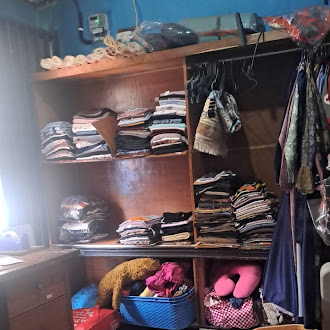
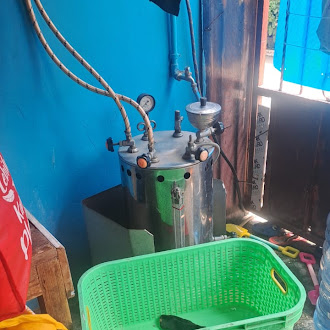
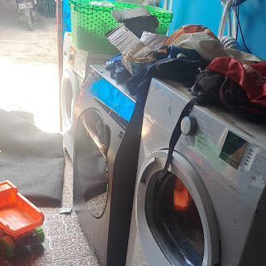
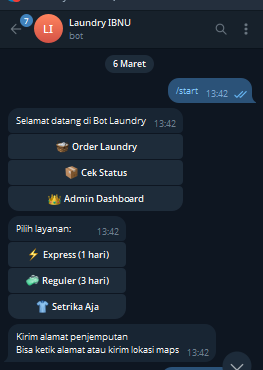

# 🌞 Bot Laundry Telegram — THE SUN

> **"Solusi Digital Cerdas untuk UMKM Modern"**  
> Project 2 – Otomasi Bot Layanan Pelanggan UMKM

[](https://python.org)
[](https://core.telegram.org/bots)
[](https://sqlite.org)
[](LICENSE)

---

## 👥 Tim Pengembang

| Nama　　　 | Role                 | Tanggung Jawab                                      |
| ------------| ----------------------| -----------------------------------------------------|
| 👨‍💻 Dafin | Backend Developer    | Alur order user, integrasi database, flow utama bot |
| 👨‍💻 Iben　| Full Stack Developer | Panel admin, update status, notifikasi              |
| 👨‍💻 Fahad | DevOps & Tester      | Cek status order, validasi input, git workflow      |

**Kelompok: THE SUN ☀️**  
Tanggal Penyusunan: 31 Maret 2026

---

## 📌 Deskripsi Project

**Bot Laundry Telegram** adalah sistem chatbot otomatis berbasis Telegram yang dirancang untuk membantu pelaku UMKM laundry dalam memberikan respons cepat, efisien, dan profesional kepada pelanggan.

Sistem ini lahir dari hasil wawancara langsung dengan **Ibu Iben**, pemilik Laundry Express di Bekasi, yang selama ini masih mencatat order secara manual menggunakan buku tulis. Rata-rata 20–40 pesan pelanggan masuk setiap harinya, dan banyak di antaranya menanyakan hal yang sama: harga, status cucian, dan waktu selesai.

Bot ini hadir untuk:
- Menjawab pertanyaan umum pelanggan secara otomatis
- Mencatat order tanpa perlu admin membalas satu per satu
- Mengirim notifikasi otomatis ketika status cucian berubah

### 📷 Kondisi UMKM Mitra (Laundry Express, Bekasi)

| Gudang Pakaian             | Mesin Uap                     | Mesin Cuci                     |
| :--------------------------:| :-----------------------------:| :------------------------------:|
|  |  |  |

### 📱 Tampilan Bot di Telegram



---
⚙️ Instalasi & Menjalankan Project
1. Clone Repository dari GitHub
git clone https://github.com/Dafin1723/Tugas-Proyek-2-THE-SUN.git
cd Tugas-Proyek-2-THE-SUN
2. Buat Virtual Environment (Disarankan)
python -m venv venv
venv\Scripts\activate

## 🚀 Fitur Utama

| Fitur | Deskripsi |
|-------|-----------|
| 💬 Auto-reply | Chatbot Telegram merespons pesan pelanggan secara otomatis |
| 📦 Pilihan Layanan | Express (1 hari), Reguler (3 hari), Setrika Saja |
| 💰 Info Harga Otomatis | Harga dihitung otomatis berdasarkan berat cucian |
| 📍 Input Lokasi | Mendukung kirim lokasi via Maps atau alamat teks manual |
| 📊 Cek Status Order | Pelanggan bisa cek status cucian kapan saja lewat kode order |
| 🔐 Panel Admin | Dashboard khusus admin untuk kelola dan update status order |
| 🔔 Notifikasi Otomatis | Sistem notif ke pelanggan saat status laundry berubah |

---

## 💰 Daftar Harga Layanan

| Layanan | Harga per Kg | Estimasi Selesai |
|---------|-------------|-----------------|
| ⚡ Express | Rp 9.000/kg | 1 hari |
| 🌀 Reguler | Rp 6.500/kg | 3 hari |
| 👔 Setrika Saja | Rp 3.000/kg | Menyesuaikan |

> Pembayaran dilakukan secara **COD (Cash on Delivery)**


## 🛠️ Teknologi yang Digunakan
 
| Teknologi | Versi | Fungsi |
|-----------|-------|--------|
| Python | 3.x | Bahasa pemrograman utama |
| python-telegram-bot | Latest | Library core bot Telegram |
| SQLite | Built-in | Database lokal penyimpanan order |
| python-dotenv | Latest | Manajemen variabel lingkungan (token, dll) |
 
---
 
## 📁 Struktur Folder
 
```
Tugas-Proyek-2-THE-SUN/
│
├── src/
│   ├── bot_laundry.py        # File utama bot (entry point)
│   ├── laundry.db            # Database SQLite (dibuat otomatis)
│   └── .env                  # Konfigurasi token (buat manual)
│
├── docs/
│   ├── Kebutuhan_Sistem.docx # Dokumen kebutuhan sistem
│   ├── Wawancara.docx        # Hasil wawancara UMKM
│   └── img/
│       ├── foto_bot.png      # Screenshot tampilan bot
│       ├── foto_gudang.png   # Foto lokasi UMKM
│       ├── git_workflow.png  # Diagram git workflow tim
│       └── ...
│
├── requirements.txt          # Daftar dependencies
└── README.md                 # Dokumentasi project ini
```
 
---
 
## ⚙️ Instalasi & Menjalankan Project
 
### 1. Clone Repository
 
```bash
git clone https://github.com/Dafin1723/Tugas-Proyek-2-THE-SUN.git
cd Tugas-Proyek-2-THE-SUN
```
 
### 2. Buat Virtual Environment (Disarankan)
 
```bash
python -m venv venv
 
# Windows:
venv\Scripts\activate
 
# macOS/Linux:
source venv/bin/activate
```
 
Jika berhasil, akan muncul `(venv)` di terminal.
 
### 3. Install Dependencies
 
```bash
pip install -r requirements.txt
```
 
Isi `requirements.txt`:
```
python-telegram-bot
python-dotenv
```
 
### 4. Dapatkan Token Bot Telegram
 
1. Buka Telegram → cari **@BotFather**
2. Ketik `/start` lalu `/newbot`
3. Ikuti instruksi untuk memberi nama bot
4. Salin **TOKEN** yang diberikan BotFather
 
### 5. Buat File Konfigurasi `.env`
 
Buat file `.env` di dalam folder `src/`:
 
```env
TOKEN=ISI_TOKEN_BOT_KAMU_DI_SINI
ADMIN_ID=ISI_TELEGRAM_USER_ID_ADMIN
```
 
> 💡 **Cara cek Telegram User ID kamu:** Chat ke @userinfobot di Telegram
 
### 6. Jalankan Bot
 
```bash
cd src
python bot_laundry.py
```
 
Bot akan aktif dan siap menerima pesan di Telegram.
 
---
 
## 🔄 Alur Penggunaan Sistem
 
### 👤 Alur Pelanggan
 
```
/start
  └─► Pilih "Order Laundry"
        └─► Pilih Layanan (Express / Reguler / Setrika)
              └─► Kirim Lokasi (Maps atau teks alamat)
                    └─► Sistem simpan order & buat kode unik
                          └─► Notifikasi dikirim ke Admin
                                └─► Tunggu penjemputan & proses
                                      └─► Notifikasi "Selesai" diterima
```
 
### 👑 Alur Admin
 
```
Masuk Panel Admin (/admin)
  └─► Lihat Daftar Order
        └─► Pilih Order
              └─► Aksi:
                    ├─► Timbang (input berat → harga dihitung otomatis)
                    ├─► Update Status (Diproses / Diantar / Selesai)
                    └─► Notifikasi otomatis dikirim ke pelanggan
```
 
---
 
## 🗄️ Struktur Database (SQLite)
 
Tabel `orders`:
 
| Field | Tipe | Keterangan |
|-------|------|-----------|
| `kode` | TEXT | Kode unik order (auto-generate) |
| `user_id` | INTEGER | ID pengguna Telegram |
| `nama` | TEXT | Nama pelanggan |
| `layanan` | TEXT | Jenis layanan (Express/Reguler/Setrika) |
| `alamat` | TEXT | Alamat teks (jika tidak kirim GPS) |
| `lat` | REAL | Latitude lokasi (jika kirim GPS) |
| `lon` | REAL | Longitude lokasi (jika kirim GPS) |
| `berat` | REAL | Berat cucian dalam kg |
| `harga` | INTEGER | Total harga setelah ditimbang |
| `status` | TEXT | Status order saat ini |
| `tanggal` | TEXT | Waktu order dibuat |
 
---
 
## 🌿 Git Workflow Tim
 

 
Tim membagi pekerjaan ke 3 branch utama:
 
| Branch | PIC | Fitur |
|--------|-----|-------|
| `feature/order-flow` | Orang 1 (Dafin) | Setup .env, start menu, pilih layanan, kirim lokasi |
| `feature/cek-status` | Orang 2 (Iben) | Cek status by kode order, notifikasi user, validasi input |
| `feature/admin-panel` | Orang 3 (Fahad) | Setup DB & tabel orders, panel admin, update status |
 
Setiap fitur di-merge ke `main` via **Pull Request**, lalu digabung menjadi `main final` siap demo.
 
---
 
## ⚠️ Keterbatasan & Pengembangan ke Depan
 
### Keterbatasan Saat Ini
 
| No | Masalah | Keterangan |
|----|---------|-----------|
| 1 | ❗ Fitur cek status belum sempurna | Query ke DB dan tampilkan hasil belum selesai |
| 2 | ⚠️ Tidak ada validasi input berat | Admin bisa input nilai non-angka |
| 3 | 🔁 Kode order berpotensi duplikat | Algoritma generate belum cek keunikan ke DB |
| 4 | 🔓 Tidak ada enkripsi data pelanggan | SQLite menyimpan plain text |
| 5 | 🚫 Tidak ada error handling global | Bot bisa crash jika ada input tak terduga |
 
### Rencana Pengembangan
 
- [ ] Integrasi pembayaran digital (GoPay / QRIS)
- [ ] Laporan rekap harian/mingguan untuk admin
- [ ] Fitur promo dan diskon otomatis
- [ ] Antarmuka web untuk monitoring order
- [ ] Enkripsi data pelanggan
 
---
 
## 📄 Dokumen Pendukung
 
| Dokumen | Keterangan |
|---------|-----------|
| [Kebutuhan Sistem](docs/Kebutuhan_Sistem.docx) | Analisis kebutuhan fungsional & non-fungsional |
| [Hasil Wawancara](docs/Wawancara.docx) | Wawancara dengan Ibu Iben (Laundry Express, Bekasi) |
 
---
 
## 📜 Lisensi
 
© 2026 THE SUN — All Rights Reserved.  
Project ini dibuat untuk keperluan akademik **Gamelab**.
 
---
 
<div align="center">
  <b>🌞 THE SUN — Project 2</b><br>
  Dafin • Iben • Fahad
</div>
 